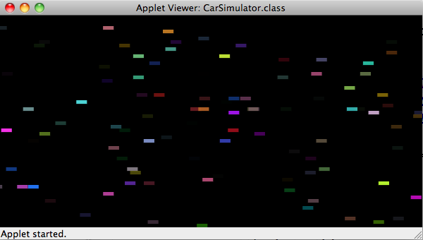

# U20 | Car-Simulator

Erstellen Sie ein Programm, das den Verkehr auf einer mehrspurigen
Straße animiert:

- Alle Fahrzeuge starten am linken Rand der Zeichenfläche.

- Die Fahrzeuge fahren in Spuren, jede Spur ist so hoch wie die
  Fahrzeuge (die Fahrzeughöhe ist konstant).

- Auf einer Spur können mehrere Fahrzeuge mit unterschiedlichen
  Geschwindigkeiten fahren.

- Fährt ein Fahrzeug rechts aus dem Bild heraus, so wird seine
  Position wieder auf den Anfang derselben Spur gesetzt.

- Jedes Fahrzeug hat eine zufällige Farbe inkl. Alpha-Transparenz
  (vgl. verfügbare Konstruktoren der Klasse `Color`).

- Die Geschwindigkeit des Fahrzeugs wird ebenfalls zufällig bestimmt
  (zwischen `2.0` und `10.0`).

{ width=50% }

Die Klasse `Car` ist vollständig für die Berechnung der Fahrzeugfarben
und Positionen zuständig. Aus der Klasse `Cars` werden lediglich die Methoden ` update``() ` und ` draw``() ` der Objekte der Klasse `Car` aufgerufen. Gegeben ist der folgende Code:
```java
    public class Cars extends GraphicsApp {

        private static final int CAR_NUM = 100;
        private static final int CAR_WIDTH = 15;
        private static final int CAR_HEIGHT = 5;
        private static final Color BG_COLOR = Color.BLACK;
        private static final int CANVAS_WIDTH = 600;
        private static final int CANVAS_HEIGHT = 300;

        private ArrayList<Car> cars;

        public void intialize() {
            setupCanvas();
            setupCars();
        }

        public void draw() {
            drawBackground(BG_COLOR);
            drawCars();
        }

        private void setupCanvas() {
            setCanvasSize(CANVAS_WIDTH, CANVAS_HEIGHT);
            setFrameRate(FRAME_RATE);
        }

        /* Your code here... */

    public class Car {

        private float speed;
        private Rectangle car;
        private int canvasWidth;

        private static final float MIN_SPEED = 2;
        private static final float MAX_SPEED = 10;

        private Random random;

        public Car(int carWidth, int carHeight, int canvasWidth, int canvasHeight) {
            this.canvasWidth = canvasWidth;
            random = new Random();

            Color carColor = createRandomColor();
            int randomYPos = getRandomYPos(carHeight, canvasHeight);
            speed = getRandomSpeed();

            car = new Rectangle(0, randomYPos, carWidth, carHeight, carColor);
        }

        /* Your code here... */
```
